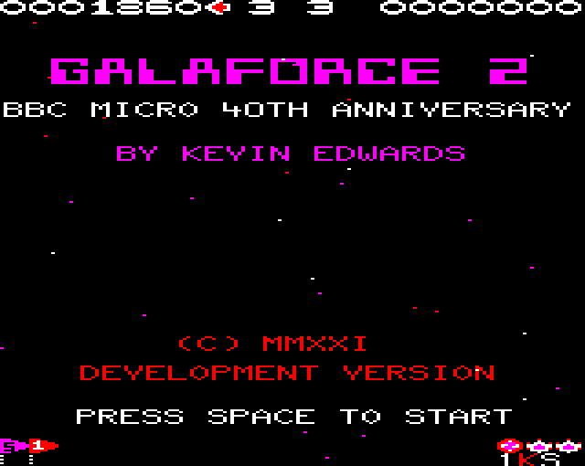

# Galaforce 2 ( BBC Micro )

**Version V1.00**

(c) Kevin Edwards 1987-2021

40 years ago, on the 1st December 1981, the BBC Micro was launched. Demand was very high and Acorn struggled to make enough machines, however, by early 1982 things started to improve. For many school-children, the BBC Micro made a long lasting impression, and for many of us it also shaped our future careers. Mine was making video games, something that I was still doing until recently when I decided to retire.

I have decided to mark this occasion by releasing the entire buildable source code for 'Galaforce 2 ( Aliens' Revenge )' to preserve it for the future.

In 1987 I began writing this sequel to the successful 'Galaforce' shoot-em-up game for the BBC Micro and Electron home computers. Galaforce 2 was published by Superior Software in 1988 on a compilation tape/disc with three other titles ( Play It Again Sam 6 ). Sadly, many people didn't know of this games existence as it didn't get the publicity that the first one was fortunate enough to have. Also, the BBC Micro was in decline and very few full price games were around as compilation titles dominated the charts. As a consequence sales were much lower.

The game is written entirely in 6502 assembly language. The BBC Micro had only 32K Bytes of RAM so software had to be carefully crafted to fit into memory.

The original BBC Micro Galaforce was missing important game-play elements that I was unable to add due to lack of memory. It used screen MODE 2 which took away 20K of the 32K RAM available - and the OS took a bit more away too! So to implement these important features I changed the game to use MODE 5 which had the same screen resolution as MODE 2, but had only 4 colours available compared with 16. This allowed me to make the following improvements:-

* Pick-Up Capsules ( Good and bad ones )
* Two-player mode ( Not at the same time! )
* Level / Stage 'Boss' battles
* More Active sprites being rendered
* More Sprites Graphics
* More Levels/Patterns
* Narrow / Widescreen display mode support
* Level Select / Continue mode
* New Music tracks ( By Martin Galway )

Originally, the BBC BASIC in-line assembler was used to build the code. However, I decided to make the codebase assemble using 'BeebAsm' on a PC. The source code needed to be re-worked a bit to achieve this. I had to de-tokenizing all of the BBC BASIC files and adapt the code to use BeebAsm friendly directives / commands. This now allows Visual Code or other IDEs to be used to build the code in a nice development environment.

The source present here is for the BBC Micro version of the game. I had slightly different code for the Acorn Electron. I hope to make the Electron version available in the future when I get more time.

I have changed the game's title page to reflect the Beeb's 40th Anniversary, but apart from that it's the original game as released.

I hope it is useful to people who have an interest in 6502 assembly language programming and to those who would like to know how games were made in the 1980s.

Happy Birthday, BBC Micro, and thank you to Martin Galway and all the people at Acorn Computers and Superior Software for making this game possible!

An even bigger thank you to Pete Davidson, my Computer Studies teacher, who encouraged and taught me so much about programming, especially 6502 machine code.

If you find any of my retro work interesting or useful please support me with a hot, fresh Ko-fi (https://ko-fi.com/kevedwardsretro)

# Build Tools required ( PC )

To build the game you first need to install the following tools:-

* [beebasm](https://github.com/stardot/beebasm)

# Build Steps ( PC )

Run 'make.bat' from a command prompt whilst in the project's root folder. This will assemble the code and output 'Galaforce2BBC.ssd' in the same folder. This disk image file can be loaded by many different BBC Micro Emulators, including B-em and BeebEm.

Alternatively, you could use 'Visual Studio Code' with the 'Beeb VSC' extension. I have also included the required workspace and .json files required to do this.

* [beeb-vsc](https://marketplace.visualstudio.com/items?itemName=simondotm.beeb-vsc)

# Additional Notes

You can find me on Twitter @KevEdwardsRetro where I ramble on about all kinds of retro computer and video game things. Please drop by and say hello.

Galaforce is pronounced 'Ga-luh-faws'

Many thanks to Rich Talbot-Watkins for his great work on BeebAsm and Simon M for the wonderful Beeb VSC.

Thank you for reading this far.
